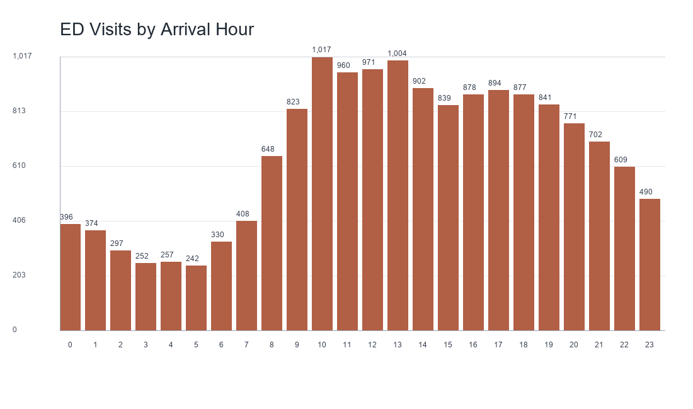

# Emergency Department Patient Flow Analytics

An end-to-end healthcare analytics project using the **2022 National Hospital Ambulatory Medical Care Survey (NHAMCS) Emergency Department Public Use File**. The project combines reproducible data preparation, MySQL analytics, Python exploratory analysis, machine learning, and an interactive Streamlit dashboard to examine emergency-department demand, waiting performance, patient acuity, and outcomes.

## Project outcome

The final project provides:

- A validated 16,025-visit analytical dataset with 39 selected variables.
- MySQL staging, typed-table, KPI, validation, and reusable-view scripts.
- Python exploratory analysis and reproducible exported figures.
- A leakage-controlled model comparison for predicting 2-hour extended waits.
- A responsive Streamlit dashboard with filters, accessible charts, model evaluation, SQL documentation, and management recommendations.
- Final executive and business-insight reports.

## Key findings

| Measure | Result |
|---|---:|
| Sampled ED visits | 16,025 |
| Visits with a valid wait time | 13,272 |
| Average wait | 36.0 minutes |
| Median wait | 14 minutes |
| Average visit length | 298.6 minutes |
| Median visit length | 191 minutes |
| 2-hour extended-wait rate | 6.83% of valid waits |
| 4-hour long-wait rate | 1.79% of valid waits |
| Admission rate | 13.24% |
| Left-without-being-seen rate | 2.04% |
| Ambulance-arrival rate | 17.77% |

The busiest observed month was February, the busiest arrival day was Monday, and 10:00 was the highest-volume arrival hour. Waiting time was right-skewed: most sampled visits had short waits, while a smaller group experienced very long waits.



## Business questions

The analysis addresses the following operational questions:

1. When are sampled ED arrivals highest by month, day, and hour?
2. What are the average and median waiting and visit-length measures?
3. What share of valid waits meet the 2-hour and 4-hour thresholds?
4. How does waiting vary by triage level, ambulance arrival, age group, sex, region, and metropolitan status?
5. What proportion of sampled visits result in admission, observation, or patients leaving before care is completed?
6. Which time periods show the strongest descriptive indicators of ED operational pressure?
7. Can arrival-time and near-arrival information help identify extended-wait risk?

Detailed findings and recommendations are available in [business_insights.md](reports/business_insights.md) and [executive_summary.md](reports/executive_summary.md).

## Analytical architecture

```text
CDC/NCHS Stata source
        |
        v
Python preparation and cleaning
        |
        +--> Clean analytical CSV --> Python EDA --> Figures and reports
        |                              |
        |                              +--> Model comparison and metrics
        |                              +--> Streamlit dashboard
        |
        +--> MySQL staging --> Typed ed_visits table --> KPI queries and views
```

The deployed dashboard intentionally reads the committed clean CSV so it can run without database credentials. The MySQL layer independently reproduces the same analytical table, KPI definitions, and modelling feature contract.

## Dashboard

Live DashBoard : https://emergency-department-patient-flow-analytics.streamlit.app/

The Streamlit application contains eight sections:

- Overview
- Patient Flow
- Waiting Times
- Triage & Groups
- Outcomes
- Data & SQL
- ML Evaluation
- Recommendations

Filters cover month, arrival day and hour, triage, ambulance arrival, region, metropolitan status, and sex. The default filter state retains visits with missing arrival-hour values, and all wait rates use visits with valid waits as their denominator.

## Machine-learning result

The primary target is `extended_wait_2hr_flag`, defined as a wait of at least 120 minutes. Only arrival-time or near-arrival fields are used. Visit length, raw wait time, diagnoses, procedures, admission, observation, departure outcomes, and ED death are excluded from the feature set.

The balanced Random Forest is the strongest tested model:

| Metric | Result |
|---|---:|
| Accuracy | 0.794 |
| Precision | 0.164 |
| Recall | 0.492 |
| F1 | 0.246 |
| ROC-AUC | 0.715 |

The model is an analytical prototype. Its limited precision means it must not be used for clinical triage, automated staffing, or patient-level decisions.

## Repository structure

```text
dashboard/          Streamlit application
data/
  raw/              CDC/NCHS Stata source
  processed/        Prepared and SQL-ready analytical CSV files
docs/               Dataset selection, data dictionary, quality report, project plan
notebooks/          EDA and modelling notebooks
outputs/
  figures/          Reproducible figures
  models/           Model metrics, target balance, metadata, feature importance
reports/            Final executive summary and business insights
sql/                Ordered MySQL pipeline and KPI/view scripts
src/                Data preparation, figure generation, and model training scripts
tests/              Standard-library integrity checks
```

## Quick start

Python 3.11 or 3.12 is recommended.

```bash
python -m venv .venv
```

Activate the environment and install dependencies:

```bash
# macOS/Linux
source .venv/bin/activate

# Windows PowerShell
.venv\Scripts\Activate.ps1

pip install -r requirements.txt
```

Run the dashboard:

```bash
streamlit run dashboard/app.py
```

Regenerate the final model outputs:

```bash
python src/train_wait_prediction_models.py
```

Regenerate the repository figures:

```bash
python src/generate_eda_figures.py
```

Run integrity checks:

```bash
python -m unittest discover -s tests -v
```

## MySQL workflow

The SQL scripts target MySQL 8.0. Run them in numeric order from the repository root:

1. `sql/01_create_tables.sql`
2. `sql/02_load_data.sql`
3. `sql/03_create_final_table.sql`
4. `sql/04_kpi_queries.sql`
5. `sql/05_views_for_python.sql`

`02_load_data.sql` uses `LOAD DATA LOCAL INFILE`. Enable local-file loading in the MySQL client and adjust the CSV path if the client is not launched from the repository root.

Expected validation totals after the load:

- 16,025 rows
- 0 duplicate `visit_id` values
- 2,753 missing wait-time values
- 907 two-hour extended waits
- 238 four-hour long waits

## Dataset and scope

- **Publisher:** US Centers for Disease Control and Prevention, National Center for Health Statistics
- **Dataset:** 2022 NHAMCS Emergency Department Public Use File
- **Unit of observation:** One sampled ED visit
- **Source:** [CDC NHAMCS documentation](https://www.cdc.gov/nchs/nhamcs/documentation/index.html)
- **Technical documentation:** [2022 ED public-use file documentation](https://ftp.cdc.gov/pub/Health_Statistics/NCHS/Dataset_Documentation/NHAMCS/doc22-ed-508.pdf)
- **Privacy:** Public-use microdata with disclosure protections and no direct patient identifiers in the selected fields

The data supports analysis of an ED visit episode, not a full hospital journey. It does not contain a hospital-department field or patient-level readmission tracking, so the project does not compare departments or report readmission KPIs.

NHAMCS survey weights are retained in the dataset. The dashboard and reported results are unweighted sample statistics and must not be interpreted as national population estimates.

## Contributions

- **Owen:** Python EDA, machine learning, model evaluation, Streamlit dashboard, visual analysis, and final analytics storytelling.
- **Nimi:** MySQL schema, loading, cleaning, KPI queries, analytical views, SQL documentation, and SQL-backed business questions.
- **Shared:** Project scope, business questions, validation, executive summary, business insights, recommendations, and final review.
